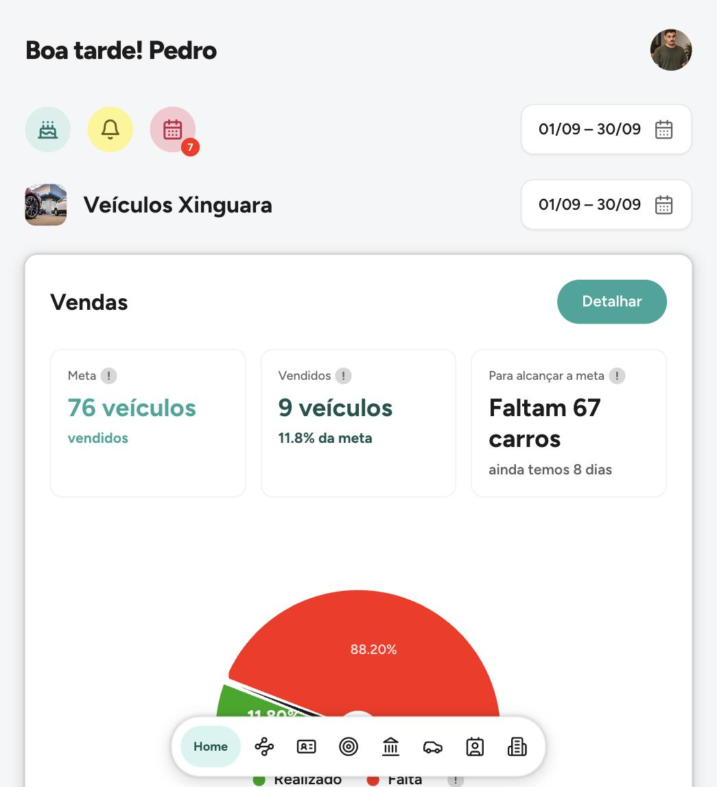
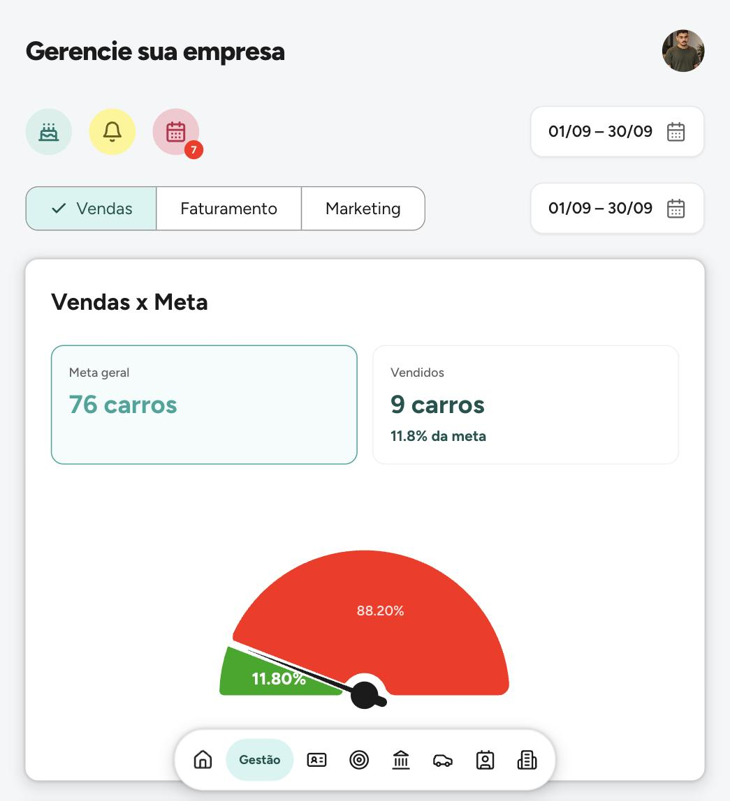
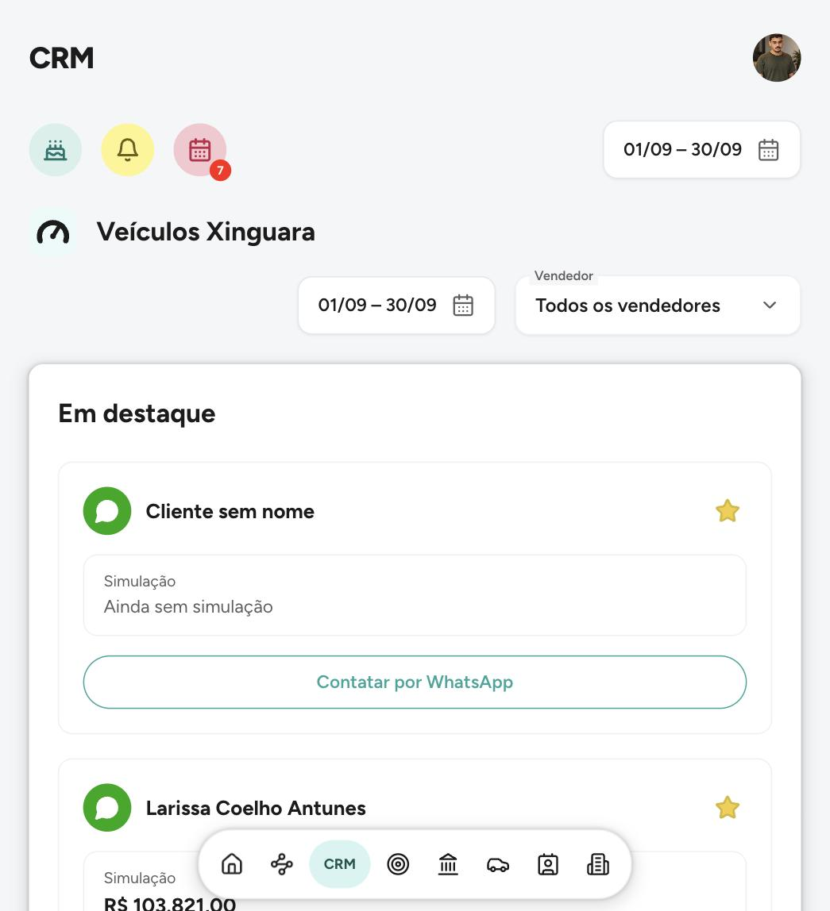

# Zayr

Sistema de gestão para lojas de veículos que eu desenvolvi. O código é privado, então aqui ficam as telas e um resumo do que ele faz.

  
  
  

## O que tem no sistema

- Vendas e metas do mês, mostrando quanto falta para bater a meta
- Leads do marketing: recebidos, em qualificação, convertidos e esquecidos
- CRM com o desempenho de cada vendedor
- Agenda da loja com test drives, contratos, vistorias e entregas
- Pós-venda: aniversários, revisões vencendo e clientes na hora da troca
- Estoque de veículos, com vitrine para compartilhar
- Feito para funcionar bem no celular

Começou pensado para loja de carro, mas a base serve para outros negócios que precisam controlar estoque, agenda e clientes.

## Contato

Quer ver uma demonstração? Fala comigo.

WhatsApp: [(94) 99101-3558](https://wa.me/5594991013558)  
Portfólio: [portfolio-pdr.netlify.app](https://portfolio-pdr.netlify.app)
